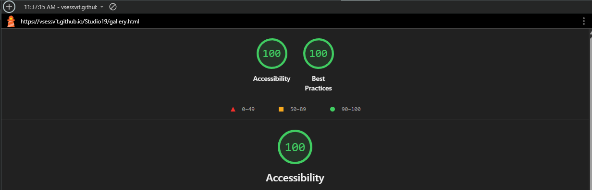
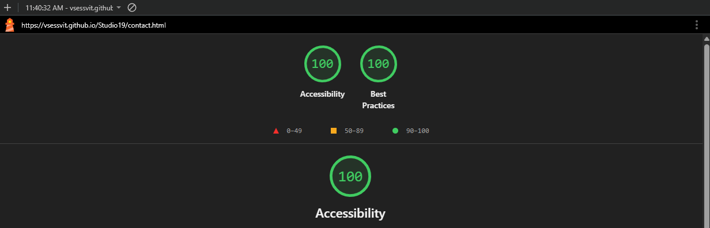

# Website Testing Report

## Introduction

To ensure the website performs correctly and consistently across different platforms, I conducted a comprehensive testing process using the following tools:

- **Lighthouse**: Evaluated performance and accessibility on both desktop and mobile.
- **W3C HTML Validator**: Checked HTML validity for each page.
- **W3C CSS Validator (Jigsaw)**: Verified CSS stylesheet compliance.

---

## Browser Testing

The website was tested on multiple browsers and devices:

- **Firefox** – No issues identified.
- **Microsoft Edge** – No issues identified.
- **Google Chrome** – Primary development browser; detailed results provided below.
- **iPhone (Mobile Safari)** – No issues identified.

---

## CSS Validation

- The main CSS stylesheet was validated using the [W3C Jigsaw Validator](https://jigsaw.w3.org/css-validator/) and passed with **no errors**.

---

## Page-by-Page Testing

Each page was tested for accessibility, HTML validity, and CSS compliance.

### `index.html` (Homepage)
- **Desktop Accessibility**: 
- **Mobile Accessibility**: 
- **HTML Validation**: 

### `process.html`
- **Desktop Accessibility**: 
- **Mobile Accessibility**: 
- **HTML Validation**: 

### `gallery.html`
- **Desktop Accessibility**: 
- **Mobile Accessibility**: 
- **HTML Validation**: 

### `contact.html`
- **Desktop Accessibility**: 
- **Mobile Accessibility**: 
- **HTML Validation**: 

### `style.css`
- **CSS Validation**: 

---

## Responsive Design Notes

During testing, I encountered layout issues on mobile devices. To address these:

- I reviewed CSS documentation and implemented `@media` queries for small screens.
- The layout of design fields was changed from horizontal to vertical on mobile.
- I tested responsiveness on:
  - Chrome DevTools
  - My phone
  - My tablet
  - My laptop
  - A desktop monitor

These steps ensured the website displays correctly across various screen sizes and devices.
